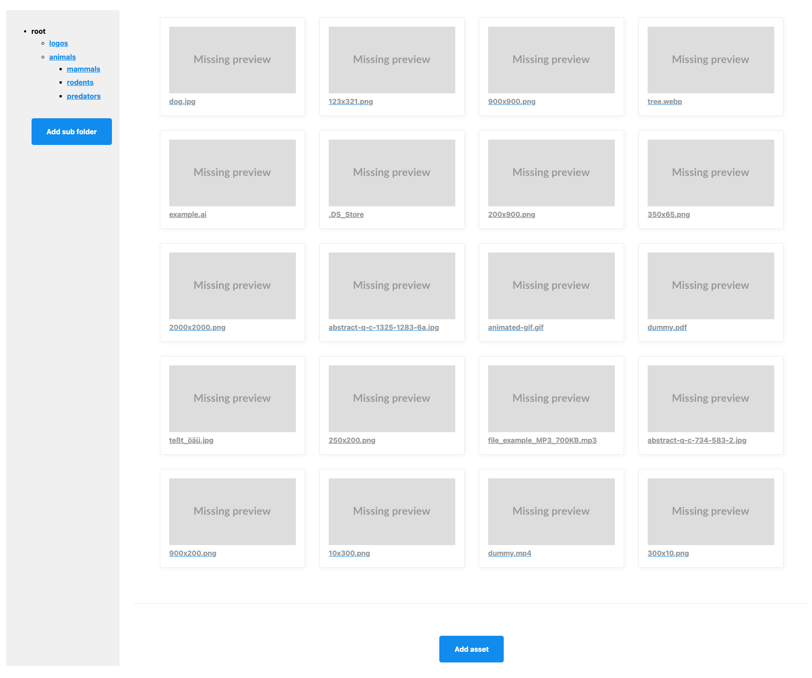

# DAM Example

Standalone PHP project that uses the Neos Event Sourced Content Repository for a simple digital asset management.

This project just provides a simple [Slim](https://www.slimframework.com/) application (using [Twig](https://twig.symfony.com/) templates) on top of the [Wwwision.DAM](https://github.com/bwaidelich/Wwwision.DAM) package.

> [!IMPORTANT]  
> This is work-in-progress, the feature set is _very_ limited and subject to change right now

## Usage

Install via [composer](https://getcomposer.org/):

```shell
composer create-project wwwision/dam-example .
```

Afterward, create a new `.env` file or copy the provided one via

```shell
cp .env.dist .env
```
and configure a doctrine DBAL connection string (see https://www.doctrine-project.org/projects/doctrine-dbal/en/4.1/reference/configuration.html#getting-a-connection)

> [!NOTE]  
> Currently only Mysql, MariaDB and PostgreSQL is supported!

Run the setup script to create the required database tables:

```shell
composer setup
```

Start the PHP built in server via:

```shell
composer serve
```

Head your browser to http://localhost:8787/

And you should be presented with an interface like this:

